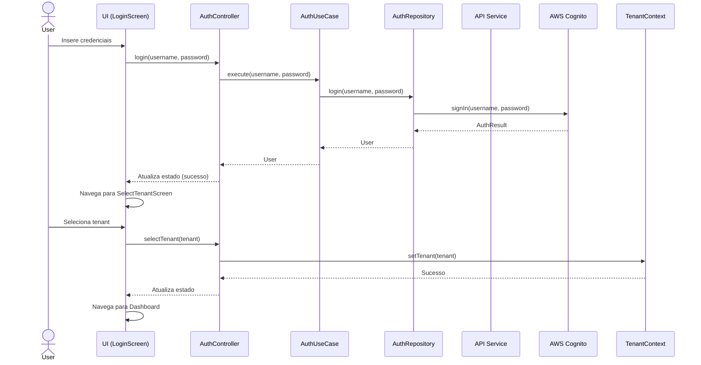
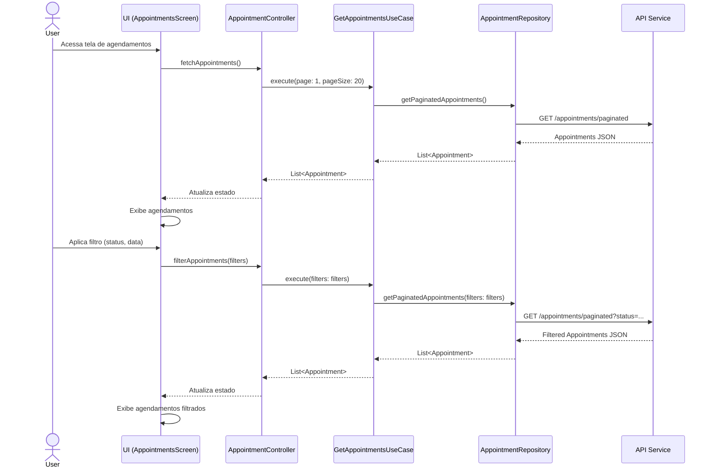
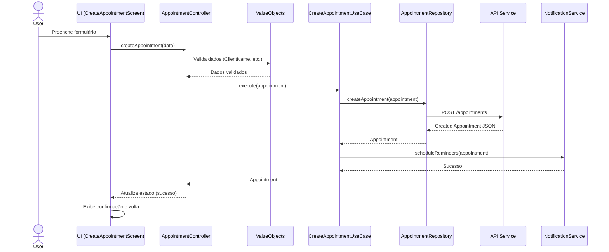
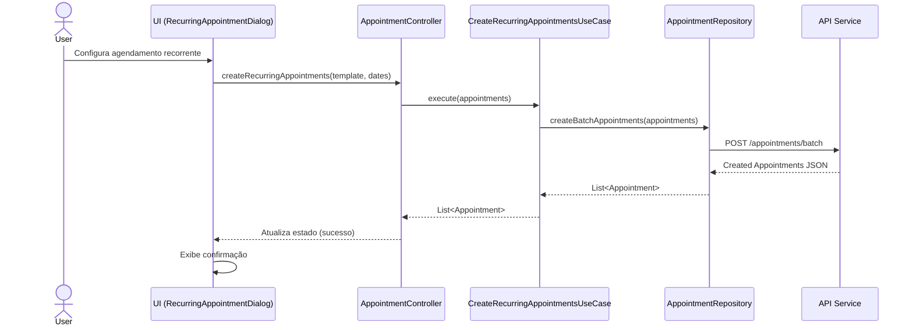
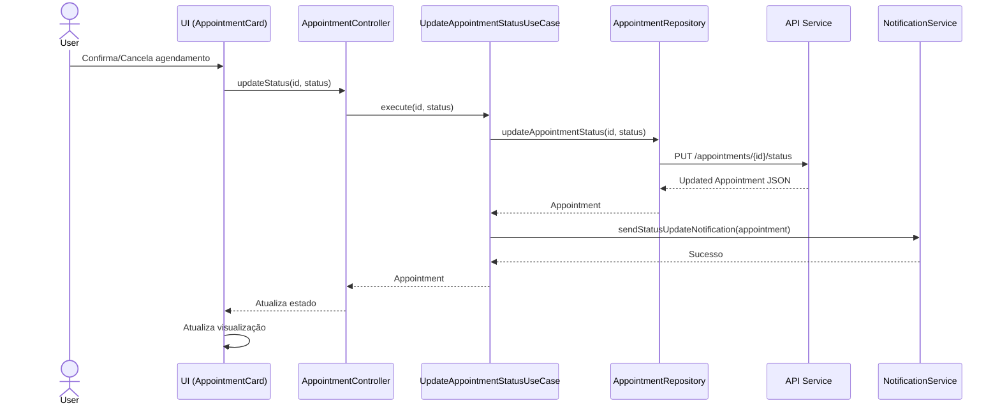
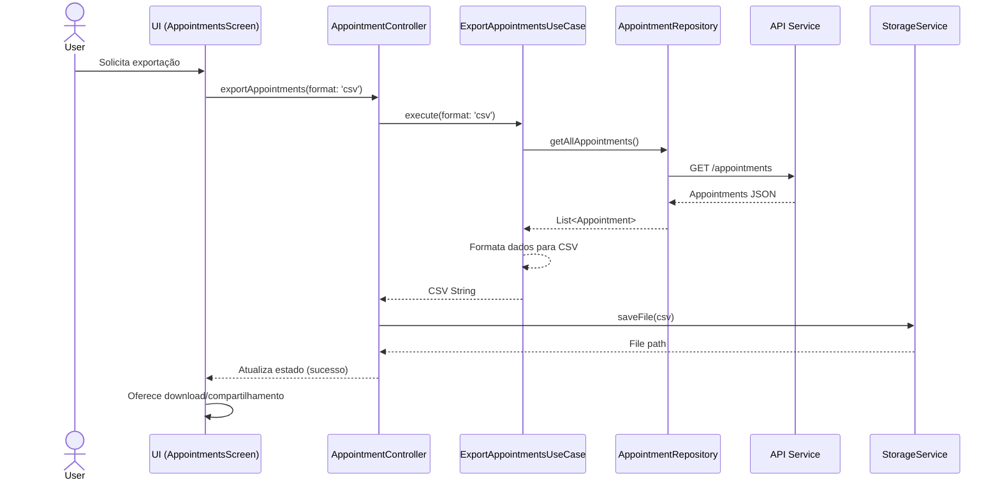
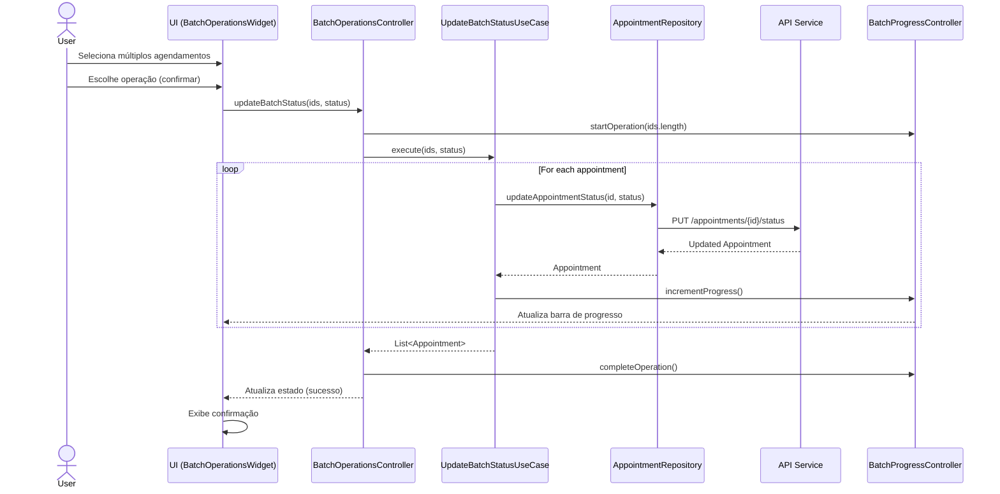
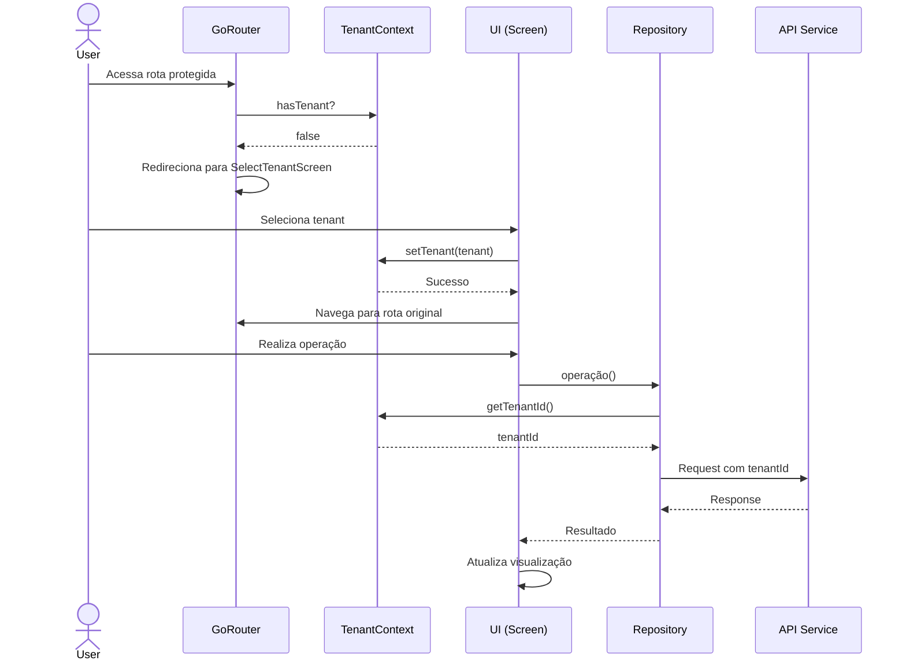
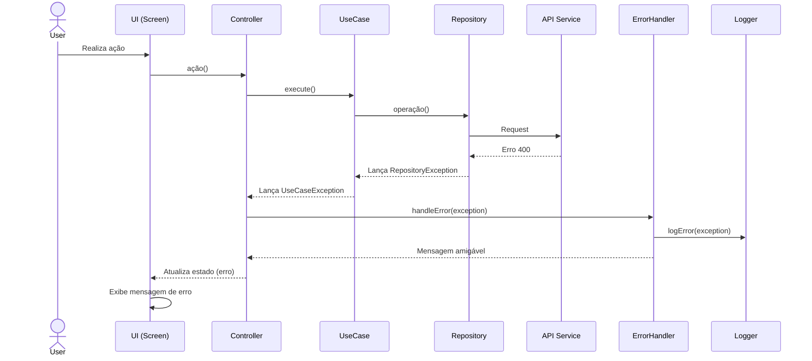
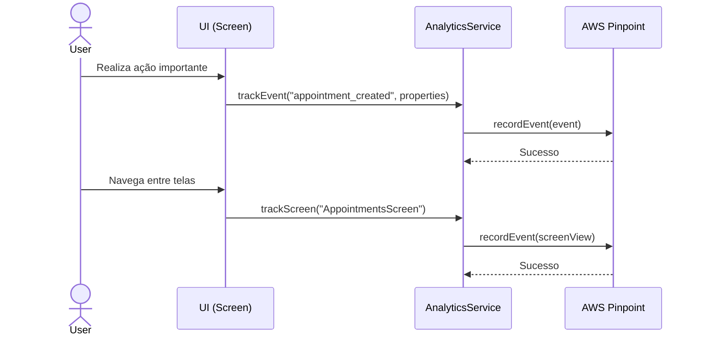

# Fluxos Principais - AGENDEMAIS

Este documento descreve os principais fluxos de usuário no sistema AGENDEMAIS, detalhando as interações entre as camadas da aplicação.

## 1. Fluxo de Autenticação e Seleção de Tenant

## 2. Fluxo de Listagem e Filtro de Agendamentos

## 3. Fluxo de Criação de Agendamento

## 4. Fluxo de Agendamentos Recorrentes

## 5. Fluxo de Atualização de Status

## 6. Fluxo de Exportação

## 7. Fluxo de Operações em Lote

## 8. Fluxo de Multi-tenancy

## 9. Fluxo de Tratamento de Erros

## 10. Fluxo de Analytics

Estes fluxos representam as principais interações no sistema AGENDEMAIS, demonstrando como os dados fluem entre as diferentes camadas da aplicação seguindo os princípios da Clean Architecture.